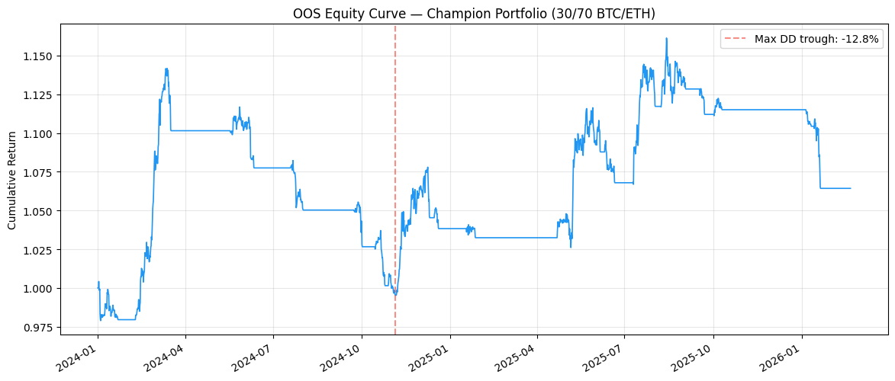
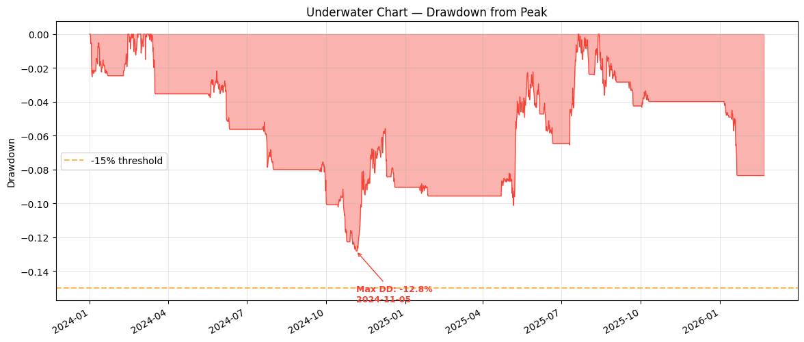
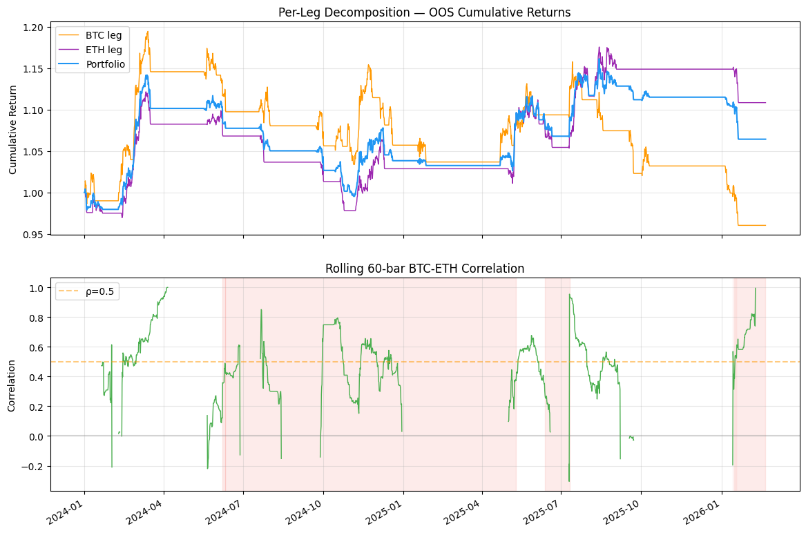
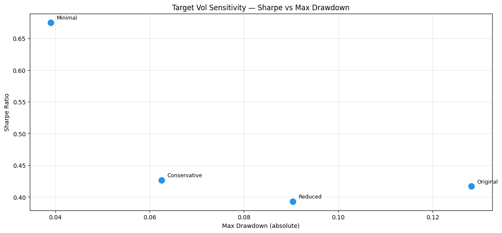
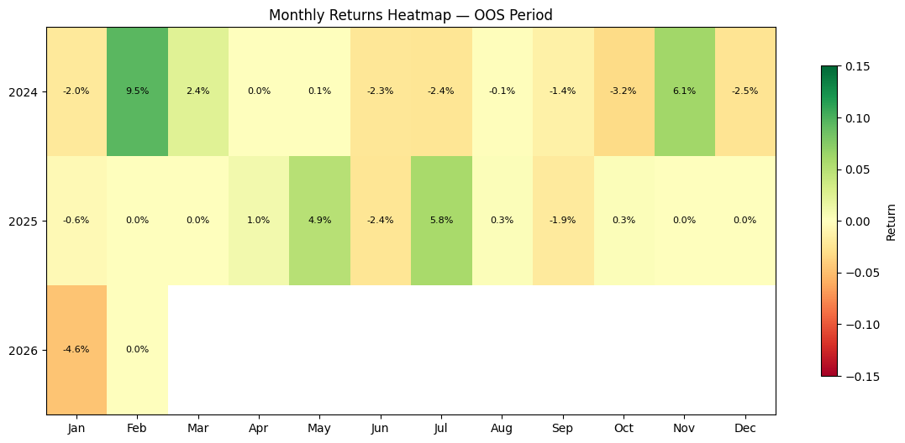
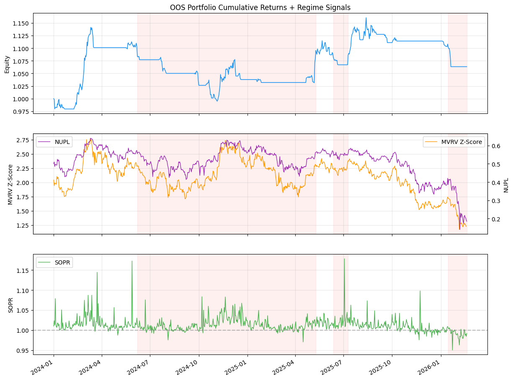

# OOS Diagnostic Report — Champion Portfolio

Generated: 2026-02-20 14:21 UTC
OOS Period: 2024-01-01 to 2026-02-20 (2346 bars, 781 days)

## Section 1: Corrected OOS Evaluation

| Metric | Value |
|--------|-------|
| Sharpe | 0.417 |
| Sortino | 0.594 |
| Max Drawdown | -0.128 |
| Total Return | 0.064 (6.4%) |
| Calmar | 0.250 |
| DSR (n=1) | 0.536 |
| Win Rate | 0.194 |
| Profit Factor | 1.061 |
| Observations | 2346 |

## Section 2: Drawdown Anatomy

| Detail | Value |
|--------|-------|
| Max Drawdown | -0.128 (-12.8%) |
| DD Start | 2024-03-13 |
| DD Trough | 2024-11-05 |
| DD Duration to Trough | 237 days |
| Recovery | 2025-07-20 (257d) |
| Severe DDs (>15%) | 0 bars below -15% |

## Section 3: Per-Leg Decomposition

| Leg | Sharpe | MaxDD | Return | Calmar | Sortino |
|-----|--------|-------|--------|--------|---------|
| BTC Don8h(82,20) | -0.114 | -0.196 | -0.040 | -0.065 | -0.162 |
| ETH Don8h(83,33) | 0.645 | -0.128 | 0.108 | 0.400 | 0.937 |
| Portfolio 30/70 | 0.417 | -0.128 | 0.064 | 0.250 | 0.594 |

**Correlation Analysis:**
- Mean rolling 60-bar correlation: 0.487
- Correlation during drawdowns (>5%): 0.476

## Section 4: Target Vol Sensitivity

| Config | BTC TV | ETH TV | Sharpe | MaxDD | Return | Calmar |
|--------|--------|--------|--------|-------|--------|--------|
| Original | 0.20 | 0.150 | 0.417 | -0.128 | 0.064 | 0.250 |
| Reduced | 0.15 | 0.100 | 0.393 | -0.090 | 0.043 | 0.232 |
| Conservative | 0.10 | 0.070 | 0.427 | -0.062 | 0.033 | 0.257 |
| Minimal | 0.05 | 0.035 | 0.675 | -0.039 | 0.040 | 0.477 |

## Section 5: Monthly Returns

## Section 6: Regime Signals

Regime overlay generated — see regime_overlay.png for visual analysis.

## Verdict: STRUCTURAL FAIL

OOS Sharpe below 0.5 indicates the trend-following edge has degraded structurally.

## Recommendation

The trend-following approach may need fundamental rethinking — consider regime-conditional entry or alternative signal generation.

---
*Report generated by run_diagnostics.py under OOS evaluation protocol.*
